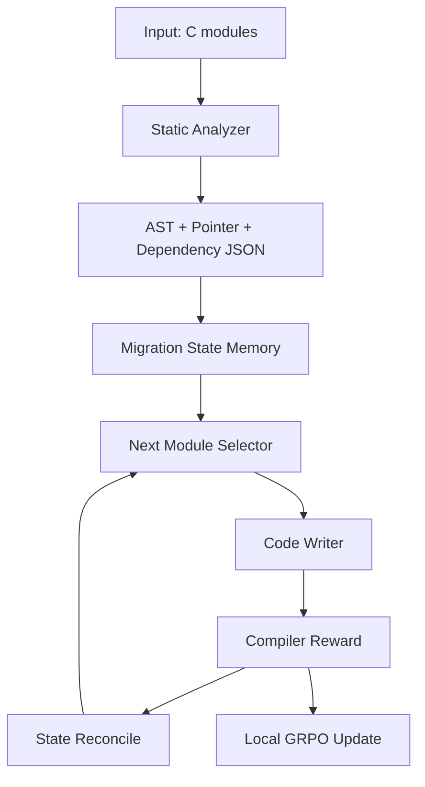

# C2Rust OpenEnv: Compiler-Driven C to Rust Migration

This repository implements an end-to-end pipeline to migrate C modules to Rust and optionally train a local model online using compiler feedback.

Core idea: use the Rust compiler as the reward oracle. The system generates Rust candidates, scores them with `cargo check`, and uses those rewards to improve future generations.

## Architecture Overview

The structure below maps your architecture diagram to the current implementation.

| Diagram block | What it does here | Main files |
|---|---|---|
| Input | C code modules and test folders are scanned in epochs | `main.py`, `tests/` |
| Static analyzer | Extracts AST, includes/exports, pointers, and call graph | `analyzer.py` |
| Persistent memory store | Stores migration progress and dependency resolution state | `memory_generate.py`, `update_memory.py`, `migration_state.json`, `migrator_data/*.json` |
| Module handler and optimizer | Picks the next unblocked module with dependency-aware heuristics | `choose_module.py` |
| Main agent loop (RL) | Choose -> rewrite -> compile/score -> update state -> repeat | `main.py` |
| Code writer (LLM agent) | Generates Rust either via OpenAI API or local QLoRA model | `C2RustAI.py`, `C2RustLocal.py` |
| Reward signal | Scores code quality from compiler diagnostics plus style penalties and bonuses | `reward.py` |
| Tester and environment API | Exposes scoring tools through OpenEnv/FastAPI for external RL agents | `env/server/c2rust_environment.py`, `env/server/app.py`, `env/client.py` |



## How the Migration Loop Works

`main.py` runs a long-horizon loop over a hardcoded curriculum of folders:

1. Select an epoch folder (for example `tests/easy/folder_1`).
2. Rebuild static analysis output for that folder with `analyzer.py`.
3. Initialize migration memory (`migration_state.json`) from `dependencies.json`.
4. Repeatedly:
   - Choose next module with `pick_next_module(...)`.
   - Generate Rust with the selected engine.
   - Mark module migrated and reconcile dependency progress.
5. Cleanup epoch artifacts.
6. After all epochs, attempt to generate a Cargo project and (for local engine) a report.

Important current behavior:

- Epoch list is hardcoded inside `main.py` (`target_epochs`).
- End-of-epoch cleanup deletes `migrator_data/`, output folder, and state file.
- `--engine local` is the actively wired training path.
- `--engine openai` path in `main.py` is currently a placeholder unless you re-enable the import assignment.

## Reward Function

`reward.py` computes a scalar score in `[0, 1]` using:

- Compilation score from `cargo check`.
- Penalties for warnings, `unsafe`, `unwrap`/`expect`, and C-like anti-patterns.
- Bonuses for idiomatic Rust (`Result`, `Option`, iterator usage).

If compile fails, partial credit is still possible based on error count, which gives smoother learning than binary pass/fail.

## Repository Map

| Path | Purpose |
|---|---|
| `main.py` | End-to-end orchestrator over all epochs |
| `analyzer.py` | libclang-based AST/pointer/dependency extraction |
| `choose_module.py` | Dependency-aware module scheduler |
| `memory_generate.py` | Builds initial migration state JSON |
| `update_memory.py` | Reconciles migrated imports/exports and global stats |
| `mark_migrated.py` | Marks selected module complete |
| `reward.py` | Compiler-driven reward logic |
| `C2RustLocal.py` | Local Qwen + QLoRA + online GRPO-style updates |
| `C2RustAI.py` | OpenAI-based translation engine |
| `gen_cargo.py` | Creates Cargo layout from generated `.rs` files |
| `env/server/app.py` | OpenEnv FastAPI entry point |
| `env/server/c2rust_environment.py` | MCP tools: `translate_c_file`, `score_rust_code` |
| `openenv.yaml` | Environment metadata and tool schema |

## Quick Start

### 1) Prerequisites

- Python 3.11+
- Rust toolchain (`cargo`, `rustc`)
- LLVM/Clang with libclang headers
- Optional NVIDIA GPU for local 4-bit QLoRA training

### 2) Install Dependencies

Full pipeline (analysis + migration + local training):

```bash
python -m venv .venv
source .venv/bin/activate
pip install --upgrade pip
pip install -r requirements.txt
```

If installing CUDA PyTorch manually, quote the version specifier:

```bash
pip install "torch>=2.0.0" --index-url https://download.pytorch.org/whl/cu121
```

Environment server only (lightweight, no training stack):

```bash
pip install -r requirements-env.txt
```

### 3) Run Local Migration (Recommended Path)

```bash
python main.py --engine local --source tests --output rust_output --wandb
```

Debug mode (no parameter update; logs reward comparisons):

```bash
python main.py --engine local --debug --debug-log debug_log.md
```

### 4) Run OpenAI Engine

```bash
export OPENAI_API_KEY=your_key_here
python main.py --engine openai --source tests
```

Note: in the current code, the OpenAI conversion function assignment in `main.py` is commented out; re-enable it before relying on this mode.

## OpenEnv Server Usage

Run server:

```bash
uvicorn env.server.app:app --host 0.0.0.0 --port 7860
```

Use the client:

```python
from env.client import C2RustEnv
import json

with C2RustEnv(base_url="http://localhost:7860") as env:
    obs = env.reset()
    c_source = obs.observation.metadata["c_source"]
    module_name = obs.observation.metadata["module_name"]

    # Replace with your generated Rust code
    result = env.call_tool(
        "translate_c_file",
        rust_code="fn main() {}",
        module_name=module_name,
    )
    print(json.loads(result))
```

Available MCP tools:

- `translate_c_file(rust_code, module_name)` returns JSON with reward and diagnostics.
- `score_rust_code(rust_code, module_name)` returns float reward only.

## CLI Flags (`main.py`)

| Flag | Description |
|---|---|
| `--source` | Root C source directory (default: `tests`) |
| `--output` | Rust output directory (default: `rust_output`) |
| `--state` | Migration state JSON path |
| `--migrator-data` | Analyzer output directory |
| `--engine` | `local` or `openai` |
| `--debug` | Local engine only: evaluate samples without training updates |
| `--debug-log` | Debug markdown log path |
| `--wandb` | Enable Weights and Biases logging (local engine) |

## Environment Variables

| Variable | Used by | Purpose |
|---|---|---|
| `OPENAI_API_KEY` | `C2RustAI.py` | Required for OpenAI engine |
| `WANDB_API_KEY` | `C2RustLocal.py` | Optional W&B online logging (falls back to offline mode) |
| `HF_TOKEN` | `main.py`, `C2RustLocal.py` | Optional adapter upload to Hugging Face Hub |
| `ADAPTER_DIR` | `C2RustLocal.py`, `main.py` | Location for LoRA adapter checkpoints |
| `MAX_CONCURRENT_ENVS` | `env/server/app.py` | OpenEnv server concurrency limit |

## Output Artifacts

Depending on mode and cleanup settings, you may see:

- `migrator_data/ast.json`
- `migrator_data/pointers.json`
- `migrator_data/dependencies.json`
- `migrator_data/call_graph.json`
- `migration_state.json`
- `rust_output/*.rs` (before epoch cleanup)
- `rust_output/training_curves.png` (local engine report)
- `rust_output/training_history.json` (local engine report)
- `rust_output/hackathon_report.md` (local engine report)
- `lora_adapters/` (or `ADAPTER_DIR`) for adapter checkpoints

## Known Limitations

- Curriculum folders are currently hardcoded in `main.py`.
- Epoch cleanup can remove generated Rust outputs unless adjusted.
- Reward is compiler-focused (`cargo check`); project-level semantic test execution is not currently integrated into the main loop.
- `analyzer.py` depends on libclang and may require include-path tuning for non-trivial external C projects.

## Docker and Hugging Face Spaces

- `Dockerfile` starts the OpenEnv API server on port `7860`.
- `openenv.yaml` declares the environment entrypoint and tool schema.
- For Spaces deployment, set secrets such as `HF_TOKEN` and optionally `WANDB_API_KEY`.

## Project Context

Built for OpenEnv Hackathon India 2026, focused on long-horizon planning for C to safe Rust migration.